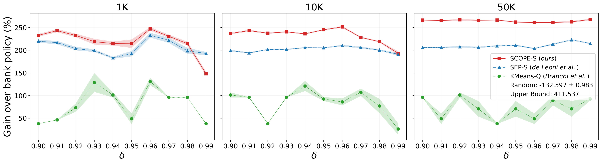
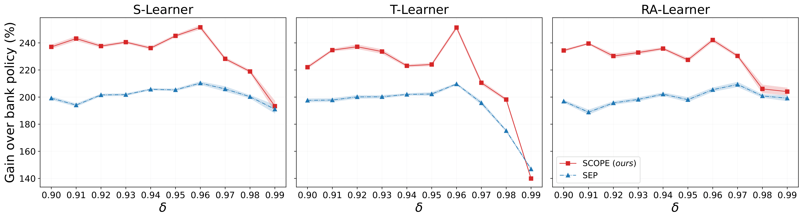
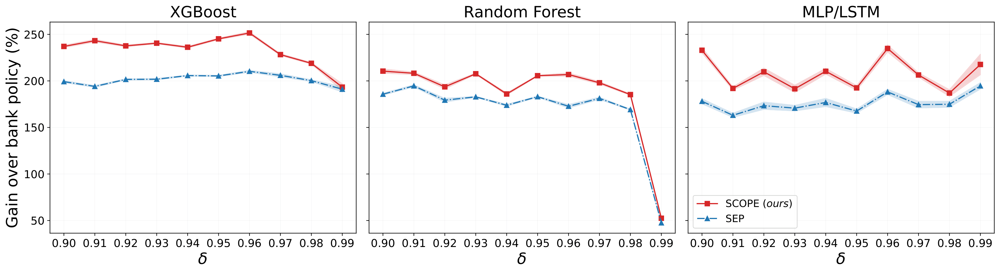
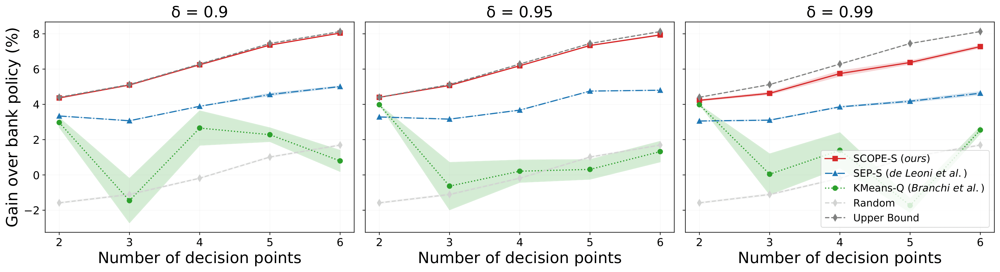
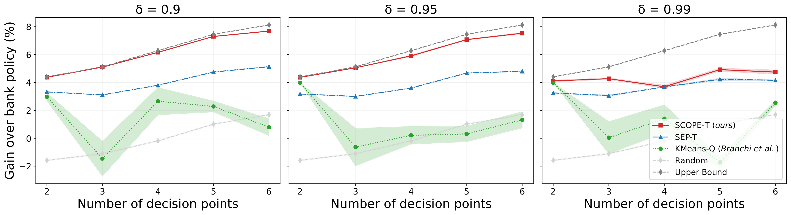
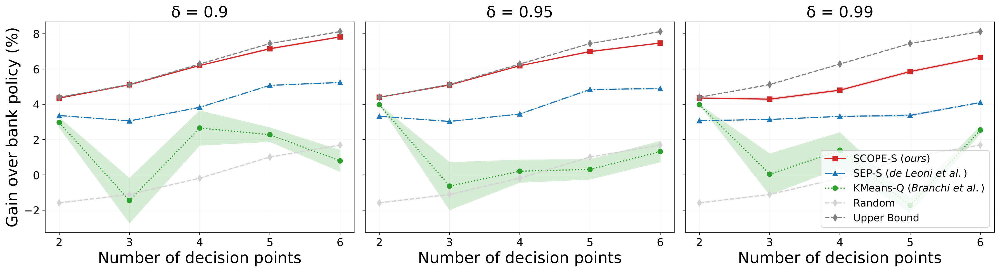
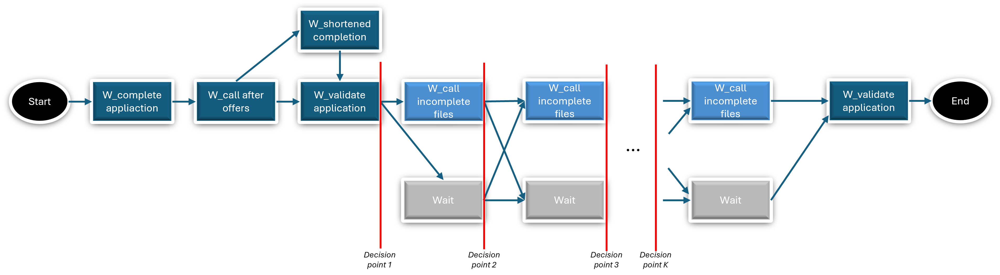

# SCOPE
This repository provides the code for the paper *"SCOPE: Sequential Causal Optimization of Process Interventions"*. 

## Overview
1) Results: resulting figures of the experiments shown in the paper and of additional experiments.
2) Code: a short explanation of the purpose of each file in the repository.
1) SimBPIC17: the process model (DFG) of the novel SimBPIC17 semi-synthetic benchmark for sequential PresPM.

# 1. Results
Below are the main results of the paper, and additional results. For each experiment we used 10 different random seeds.

## Main
### SimBank
#### Varying training size (SCOPE & SEP: S-learner, XGBoost)

#### Varying learner types (10K; SCOPE & SEP: XGBoost)

#### Varying base model types (10K; SCOPE & SEP: S-learner)

### SimBPIC17
#### Varying numbers of decision points (10K; SCOPE & SEP: S-learner, XGBoost)


## Additional experiment SimBPIC17
#### Varying numbers of decision points for T-learner (10K; SCOPE & SEP: XGBoost)

#### Varying numbers of decision points for Random Forest (10K; SCOPE & SEP: S-learner)

These additional experiments on SimBPIC17 confirm the paper's finding that SCOPE performs better regardless of the learner or base model used, mirroring the results previously shown on SimBank.

## Computational complexity
We discuss the theoretical computational complexity and the practical runtimes of each method in our [Computational Complexity Overview (PDF)](src/utils/results_tools/docs/SCOPE__Computational_Complexity.pdf).

# 2. Code
The structure of the code is as follows:
```
SCOPE/
|_ SimBPIC17/                       # The full SimBPIC17 semi-synthetic simulator
    |_ bpic2017_cleaning.ipnyb      # Cleaning of BPIC17
    |_ configs.py                   # The configuration parameters of the simulation (e.g., the decision thresholds of the bank, activity duration distributions...)
    |_ dag_functions.py             # Functions for computing the decision of the bank (based on the historical decision policy), the effect of a 'call', and the resulting outcome.
    |_ simbpic17_run.py             # Main file to run multiple simulations (for training and evaluation purposes)
    |_ simulation.py                # Code to run one simulation given parameters
    |_ tools.py                     # Functions used as tools in the simulation files
|_ SimBank/                         # The full SimBank simulator
|_ config/                          # Contains all ranges of each parameter in the hyperparameter search
|_ data/                            # Data generated for all experiments (from SimBank & SimBPIC17)
|_ res/                             # Results of the experiments
|_ scripts/
    |_ main.py                      # Main script to run all experiments: generate data, preprocess data, tune, train & eval
|_ src/        
    |_ methods/                           
        |_ kmeans_q/                    # Code for any causal computations at decision points for the KMeans_Q method (placeholder for this method, since it does not require computations)
        |_ scope/                       # Code for any causal computations at decision points for the SCOPE method (e.g., calculating q-values, value function, causal effects...)
        |_ separate/                    # Code for any causal computations at decision points for the SCOPE method (e.g., calculating causal effects...)
        |_ method_main.py               # The overall file (called in scripts/main.py) used for training and tuning of each method
    |_ utils/                           
        |_ model_tools/                 # Code for any causal computations at decision points for the KMeans_Q method (placeholder for this method, since it does not require computations)
            |_ model_eval.py                # Evaluate a model
            |_ model_functions.py           # Classes for each possible model instanece (e.g., XGBoost, LSTM...)
            |_ model_training.py            # Train a model
        |_ prep_tools/                  # Code for all different preprocessing used (aggregation encoding, tensor encoding, preprocessing for Branchi et al. (REF), etc.)
        |_ results_tools/               # Code for generating plots

```

## Installation.
The ```requirements.txt``` file provides the necessary packages for SCOPE and all experiments.
All code was written for ```python 3.11.5```.

## Running the experiments of the paper
Download the SimBank and SimBPIC17 data for the experiments from [Google Drive](https://drive.google.com/file/d/14ONs7JLqIaCQ46t1hEntOaVVUfm4-E5d/view?usp=sharing). 

Put the data in the ```data/``` folder. 

Now, the results from the paper can be reproduced by setting the ```path``` variable in the config/config.py file to your directory and running the appropriate script. For example:

```
python scripts/main.py \
        --config config/configs_methods/config_dtr.json \
        --delta 0.95 \
        --methods dtr-S-reg-R \
        --train_size 10000 \
```

Download the results of the experiments from [Google Drive](https://drive.google.com/file/d/18OD3pvRcE7jqQ44EMSedi6O5kis99uoz/view?usp=sharing). 

# 3. SimBPIC17

Below, the predefined process model (DFG) of SimBPIC17 is shown, with indicators at the decision points. The whole data-generating process is given in the folder SimBPIC17 (including generating variables, the historical decision policy of the bank, the causal effect and outcome calculations). The general purpose of each file in this folder is described above.

## DFG of SimBPIC17

